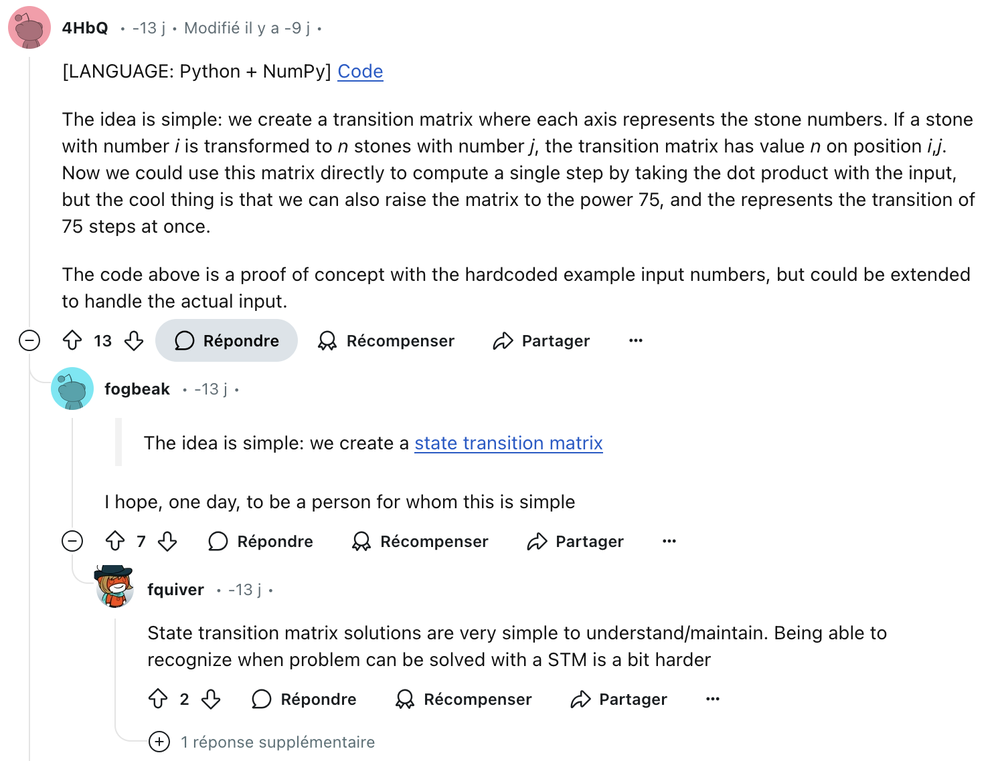

# Introduction

The 2024 adventOfCode being my first, and having no knowledge of algorithms (I'm an electronics engineer by training and I've never had to deal with this kind of problem, which I regret very much in view of some of the days of the challenge), I set off on this adventure with no pressure and no objective other than an introduction to the discipline of algorithms.


## First days and first give up

The first few days are fairly easy, a little appetizer that makes you want to keep going, but that's just an illusion! It doesn't take long for the code that used to work to become a gas machine with the second parts. You add bits and pieces of code and hope it holds until you reach day 11.

### But before that there is the day 6

Day 6 is quite frustrating. Although I easily completed the first part and understood the subtleties of the second part, the result I obtained is not correct (the example doesn’t help because I find the correct result there). I think there is a problem in my code that I can’t spot, and I decide not to get frustrated over it to conserve my energy for understanding the upcoming days (I am very behind on the schedule. In fact, I started on December 10th).

## First wall

And that's where the disappointment comes in: part 1, so simple, becomes impossible to solve, even though the calculation part has been optimized (separating an even integer into two numbers and calculating the number of digits that make up the number). After a little thought, I decided that the calculation part was too time-consuming, and that it would be possible to place the results in a dictionary, bypass the calculation if it already existed and retrieve the result from it. But yes, it must be good now! Let's run the code and .... always the same problem, it takes too long (actually, I don't know how long, but after an hour, I imagine I'll still be doing it for several years). I suspect the creators are fans of mathematics and exponential calculations in particular (you bastards).

### First cheat

So I decided to check out the Reddit page to see what the other participants had to say. It's December 24, I'm still only 11 days in (I've got a little attention problem that's slowing me down a lot, and since I'm so stubborn, I've decided not to use paper to help me structure my thoughts, because why be stupid when you can be very stupid) and I don't feel like getting stuck for hours yet again. After a little research, I came across a fairly simple solution, which shows the real difficulty of these problems: to see the problem from another angle in order to simplify it.

The description of the problem used is the one provided and written on the guy's personal web page :

```
https://advent-of-code.xavd.id/writeups/2024/day/11/
```

What is written is simple: although the statement indicates that "their order is preserved" an analysis of the rules shows that the order does not matter. One only needs to calculate, and the results are not infinite. Using a dictionary containing all the results with the number of occurrences as values allows bypassing the enormous list of calculations to be performed.

One other solution which is easy for some guys



## First lesson : BFS and DFS, you'll need to master

It is Thursday, December 26th, and the event is now over. While trying to complete the 12 puzzles before December 25th, I faced a major problem: I did not properly master the concept of graph traversal (BFS and DFS). Although the 10th puzzle was quite similar, I couldn’t apply it to the 12th puzzle. I believe that with 4 hours ahead of me, I could have done it, but the comments from my colleagues who introduced me to this adventure made it clear that mastering graph theory was necessary.

So now, before tackling other puzzles, I'm going to practice the various algorithms linked to graphs, trees and other grid paths.
